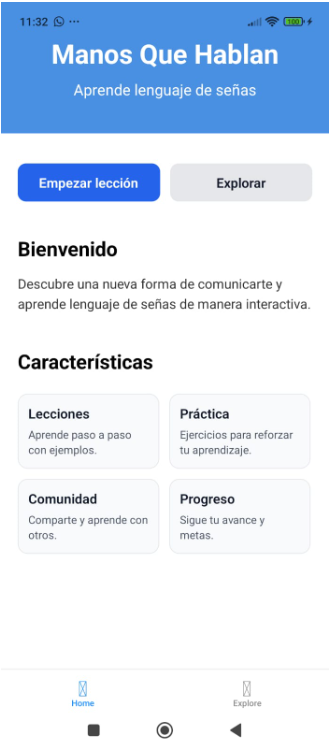
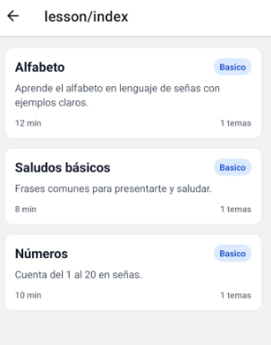
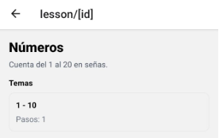
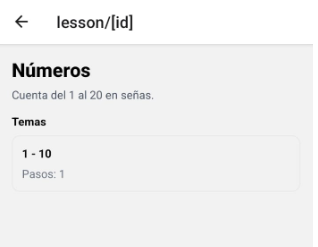

#  Manos que Hablan

[](https://github.com/jesusmariade/manosquehablan)
[](https://reactnative.dev/)
[](https://expo.dev/)
[](LICENSE)

> Plataforma inclusiva para aprender Lengua de Señas Mexicana (LSM) mediante videos interactivos, gamificación y comunidad.

--- 




##  Descripción

**Manos que Hablan** es una aplicación móvil (Android e iOS) que facilita el aprendizaje de la Lengua de Señas Mexicana a través de:

-  **Videos educativos** organizados por niveles
-  **Práctica con IA** que detecta tus señas en tiempo real
-  **Comunidad activa** donde usuarios comparten contenido
-  **Gamificación** con puntos, medallas y retos diarios
-  **Glosario visual** con cientos de señas animadas

---

##  Características principales

### Aprendizaje interactivo
- Módulos progresivos (abecedario, saludos, conversación)
- Videos con subtítulos y velocidad ajustable
- Ejercicios prácticos después de cada lección

###  Práctica con IA
- Detección de manos con MediaPipe
- Retroalimentación instantánea
- Reconocimiento del alfabeto LSM

###  Comunidad
- Sube videos enseñando señas
- Comenta y reacciona a contenido
- "Seña del día" colaborativa

###  Gamificación
- Sistema de puntos y niveles
- Medallas por logros específicos
- Rachas diarias de práctica

---

##  Stack Tecnológico

### Frontend
- **React Native** - Framework multiplataforma
- **Expo** - Desarrollo y deployment simplificado
- **NativeWind** - Tailwind CSS para React Native
- **React Navigation** - Navegación entre pantallas

### Backend (Planeado)
- **Firebase/Supabase** - Autenticación y base de datos
- **Cloudinary** - Almacenamiento de videos
- **Node.js + Express** - API REST (opcional)

### IA/ML
- **MediaPipe Hands** - Detección de puntos de la mano
- **TensorFlow.js** - Clasificación de señas
- **Teachable Machine** - Entrenamiento de modelos

---

##  Instalación

### Prerrequisitos
- Node.js v18+ ([Descargar](https://nodejs.org/))
- npm o yarn
- Expo Go app en tu dispositivo móvil

### Pasos

1. **Clona el repositorio**
```bash
git clone https://github.com/jesusmariade/manosquehablan.git
cd manosquehablan
```

2. **Instala dependencias**
```bash
npm install
```

3. **Configura variables de entorno**
```bash
cp .env.example .env
# Edita .env con tus credenciales de Firebase/Supabase
```

4. **Inicia el proyecto**
```bash
npx expo start
```

5. **Escanea el QR con Expo Go** desde tu celular
   - **Android**: Abre Expo Go y escanea el código QR
   - **iOS**: Usa la cámara del iPhone para escanear el QR

---

## 📂 Estructura del Proyecto

```
manosquehablan/
├── src/
│   ├── screens/          # Pantallas principales
│   │   ├── HomeScreen.jsx
│   │   ├── LearnScreen.jsx
│   │   ├── CommunityScreen.jsx
│   │   └── ProfileScreen.jsx
│   ├── components/       # Componentes reutilizables
│   ├── navigation/       # Configuración de rutas
│   │   └── AppNavigator.jsx
│   ├── services/         # APIs y conexiones externas
│   ├── assets/           # Imágenes, videos, fuentes
│   └── utils/            # Funciones auxiliares
├── .gitignore
├── README.md
├── package.json
└── App.js               # Punto de entrada
```

---

##  Uso

### Ejecutar en desarrollo
```bash
npx expo start
```

### Opciones de ejecución
- **Presiona `a`** - Abrir en emulador Android
- **Presiona `i`** - Abrir en simulador iOS
- **Escanea QR** - Abrir en Expo Go (tu celular)

### Limpiar caché
```bash
npx expo start --clear
```

---

##  Contribuir

¡Las contribuciones son bienvenidas!, Te agradezco de todo 💙 alguna que hagas

### Cómo colaborar

1. **Fork** este repositorio
2. Crea una **rama** para tu feature:
   ```bash
   git checkout -b feature/nueva-funcionalidad
   ```
3. **Commit** tus cambios:
   ```bash
   git commit -m " Agrega nueva funcionalidad"
   ```
4. **Push** a tu rama:
   ```bash
   git push origin feature/nueva-funcionalidad
   ```
5. Abre un **Pull Request**

### Convenciones de commits realmente solo que sea corto y explicativo solo eso
-  `:sparkles:` - Nueva funcionalidad
-  `:bug:` - Corrección de bug
-  `:memo:` - Documentación
-  `:art:` - Mejoras de UI/UX
-  `:zap:` - Mejoras de rendimiento
-  `:recycle:` - Refactorización 

Para más detalles, consulta [CONTRIBUTING.md](CONTRIBUTING.md) 

---

## 🗺️ Roadmap

### Fase 1 - MVP (En progreso)
- [x] Estructura base del proyecto
- [x] Navegación principal
- [] Pantallas principales (Home, Learn, Community, Profile)
- [ ] Sistema de autenticación
- [ ] Módulo de lecciones básicas

### Fase 2 - Aprendizaje
- [ ] 50+ videos educativos
- [ ] Sistema de progreso
- [ ] Gamificación básica
- [ ] Glosario visual

### Fase 3 - IA
- [ ] Detección de manos
- [ ] Reconocimiento del alfabeto
- [ ] Feedback en tiempo real

### Fase 4 - Comunidad
- [ ] Subida de videos
- [ ] Sistema de comentarios
- [ ] Likes y compartir
- [ ] Notificaciones

### Fase 5 - Escalabilidad
- [ ] Modo offline
- [ ] Soporte para iOS y Android nativos
- [ ] Traducción voz ↔ señas
- [ ] Certificaciones oficiales

---

## 📸 Capturas de Pantalla

###  Pantalla de Inicio
La pantalla principal muestra el progreso del usuario, seña del día y acceso rápido a lecciones.

###  Aprender
Módulos organizados por niveles con sistema de desbloqueo progresivo.

###  Comunidad
Feed social donde usuarios comparten su progreso y aprenden juntos.

###  Perfil
Estadísticas personales, logros desbloqueados y configuración de la cuenta.

>  **Próximamente**: Capturas de pantalla reales de la aplicación en funcionamiento.

---

##  Licencia

Este proyecto está bajo la Licencia MIT - ver el archivo [LICENSE](LICENSE) para más detalles.

---

## 👥 Equipo

- **Jesús María** - Creador y desarrollador principal
- GitHub: [@jesusmariade](https://github.com/jesusmariade)

---

## 📞 Contacto

- **GitHub**: [@jesusmariade](https://github.com/jesusmariade)
- **Issues**: [Reportar un problema](https://github.com/jesusmariade/manosquehablan/issues)

---

##  Agradecimientos

- Comunidad sorda de México
- Intérpretes de LSM
- Colaboradores open source
- [Expo](https://expo.dev) por facilitar el desarrollo móvil
- [React Native](https://reactnative.dev) community

---

## 📚 Recursos Adicionales

- [Documentación de Expo](https://docs.expo.dev/)
- [Documentación de React Navigation](https://reactnavigation.org/)
- [Guía de NativeWind](https://www.nativewind.dev/)
- [MediaPipe Hands](https://google.github.io/mediapipe/solutions/hands.html)

---

**¿Te gusta el proyecto? ¡Dale una ⭐ en GitHub!**